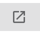
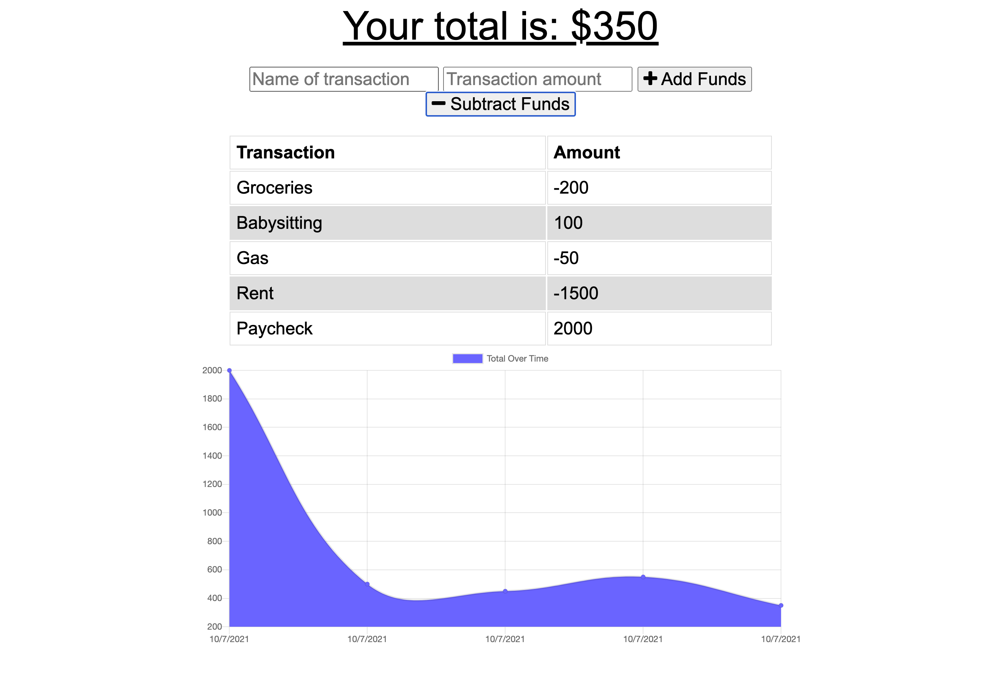

# Budget Tracker - Progressive Web Application

## Description

A progressive web application to track your budget. This software can be used in offline mode and will upload offline data to the database when reconnected.

## Install Instructions

1. Download Repo
2. `npm install`
3. `npm start`
4. Open a browser and navigate to `localhost:3000`

## Usage Instructions

Add a transaction and an amount in the form and choose "Add Funds" or "Subtract Funds"
The graph will automatically update.

### For offline use;

-   Click this icon in the top right of the address bar

## Technologies

-   [Node.JS](https://nodejs.org/en/docs/)
-   [Express.JS](https://www.npmjs.com/package/express)
-   [Mongoose](https://www.npmjs.com/package/mongoose)
-   [Morgan](https://www.npmjs.com/package/morgan)
-   [Compression](https://www.npmjs.com/package/compression)

## Links

-   [Repo](https://github.com/webdev410/budget-tracker)
-   [Deployed](https://budget-trx.herokuapp.com/)
-   [GitHub Profile](https://github.com/webdev410)

## Screenshots

